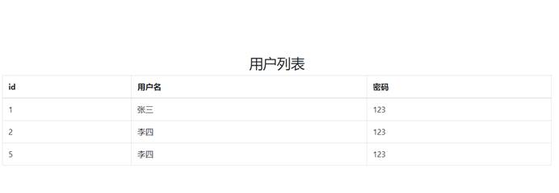

## Employee

1、查询所有记录（“/selectEmployeeAll”）


2、通过id查询(“/selectEmployee/2”)


3、增加（“/add”）

  


4、更新记录（“/updateEmployee/2”）


5、删除记录（“/deleteEmployee/2”）


## USer

**1、pom.xml**

```xml
 <dependencies>
    <!--spring的三个核心依赖-->
    <dependency>
      <groupId>org.springframework</groupId>
      <artifactId>spring-core</artifactId>
      <version>${spring.version}</version>
    </dependency>
    <dependency>
      <groupId>org.springframework</groupId>
      <artifactId>spring-web</artifactId>
      <version>${spring.version}</version>
    </dependency>
    <dependency>
      <groupId>org.springframework</groupId>
      <artifactId>spring-webmvc</artifactId>
      <version>${spring.version}</version>
    </dependency>
    <!--连接池-->
    <dependency>
      <groupId>com.alibaba</groupId>
      <artifactId>druid</artifactId>
      <version>1.1.7</version>
    </dependency>
    <!--mybatis依赖-->
    <dependency>
      <groupId>org.mybatis</groupId>
      <artifactId>mybatis</artifactId>
      <version>3.4.4</version>
    </dependency>
    <!--mybatis整合spring的依赖-->
    <dependency>
      <groupId>org.mybatis</groupId>
      <artifactId>mybatis-spring</artifactId>
      <version>1.3.0</version>
    </dependency>
    <!--事务-->
    <dependency>
      <groupId>org.springframework</groupId>
      <artifactId>spring-jdbc</artifactId>
      <version>${spring.version}</version>
    </dependency>
    <!--测试-->
    <dependency>
      <groupId>junit</groupId>
      <artifactId>junit</artifactId>
      <version>4.11</version>
      <scope>test</scope>
    </dependency>
    <dependency>
      <groupId>javax.servlet</groupId>
      <artifactId>servlet-api</artifactId>
      <version>2.5</version>
    </dependency>
    <!--json数据处理依赖-->
    <dependency>
      <groupId>com.fasterxml.jackson.core</groupId>
      <artifactId>jackson-databind</artifactId>
      <version>2.9.5</version>
    </dependency>
    <!--javaScript标签库-->
    <dependency>
      <groupId>javax.servlet.jsp.jstl</groupId>
      <artifactId>jstl</artifactId>
      <version>${jstl.version}</version>
    </dependency>

  </dependencies>
```

**2、applicationContext.xml**

```xml
<?xml version="1.0" encoding="UTF-8"?>

<beans xmlns="http://www.springframework.org/schema/beans"
       xmlns:xsi="http://www.w3.org/2001/XMLSchema-instance"
       xmlns:content="http://www.springframework.org/schema/context"
       xmlns:tx="http://www.alibaba.com/schema/stat"
       xsi:schemaLocation="http://www.springframework.org/schema/beans http://www.springframework.org/schema/beans/spring-beans.xsd http://www.springframework.org/schema/context http://www.springframework.org/schema/context/spring-context.xsd http://www.alibaba.com/schema/stat http://www.alibaba.com/schema/stat.xsd">
    <!--读取jdbc配置文件-->
    <content:property-placeholder location="classpath:jdbc.properties"/>
    <!--连接池-->
    <bean id="dataSource" class="com.alibaba.druid.pool.DruidDataSource">
        <property name="driverClassName" value="${jdbc.driver}"/>
        <property name="password" value="${jdbc.password}"/>
        <property name="username" value="${jdbc.username}"/>
        <property name="url" value="${jdbc.url}"/>
        <property name="maxActive" value="10"/>
        <property name="maxWait" value="3000"/>
    </bean>
    <!--spring整合mybatis-->
    <bean id="sqlSessionFactory" class="org.mybatis.spring.SqlSessionFactoryBean">
        <property name="dataSource" ref="dataSource"/>
        <property name="configLocation" value="classpath:mybatis.xml"/>
    </bean>
    <!--mapper接口扫描-->
    <bean class="org.mybatis.spring.mapper.MapperScannerConfigurer">
        <property name="basePackage" value="com.dao"/>
    </bean>
    <!--事务配置-->
    <bean id="transactionManager" class="org.springframework.jdbc.datasource.DataSourceTransactionManager">
        <property name="dataSource" ref="dataSource"/>
    </bean>
    <tx:annotation-driven/> <!--开启事务注解 默认关联transactionManager-->
    <!--扫描service-->
    <content:component-scan base-package="com.service"/>
</beans>
```


**3、springmvc.xml**

```xml
<?xml version="1.0" encoding="UTF-8"?>
 <beans xmlns="http://www.springframework.org/schema/beans"
    xmlns:xsi="http://www.w3.org/2001/XMLSchema-instance" xmlns:mvc="http://www.springframework.org/schema/mvc"
    xmlns:context="http://www.springframework.org/schema/context"
    xsi:schemaLocation="http://www.springframework.org/schema/beans http://www.springframework.org/schema/beans/spring-beans.xsd http://www.springframework.org/schema/mvc http://www.springframework.org/schema/mvc/spring-mvc.xsd http://www.springframework.org/schema/context http://www.springframework.org/schema/context/spring-context.xsd">
   <!--扫描controller-->
   <context:component-scan base-package="com.controller"/>
   <!--注解方式的处理器映射器和处理器适配器-->
   <mvc:annotation-driven></mvc:annotation-driven>
   <!--试图解析器-->
   <bean class="org.springframework.web.servlet.view.InternalResourceViewResolver">
     <!--前缀-->
     <property name="prefix" value="/WEB-INF/jsp/"/>
     <!--后缀-->
     <property name="suffix" value=".jsp"/>
   </bean>
 </beans>
```


**4、mybatis.xml**

```xml
<?xml version="1.0" encoding="UTF-8" ?>
 <!DOCTYPE configuration PUBLIC "-//mybatis.org//DTD Config 3.0//EN"
     "http://mybatis.org/dtd/mybatis-3-config.dtd">
 <configuration>
   <typeAliases>
     <package name="com.bean"/>
   </typeAliases>
 </configuration>
```


**5、jdbc.properties**

```xml
jdbc.driver=com.mysql.jdbc.Driver
 
 jdbc.url=jdbc:mysql://localhost:3306/maven-ssm?useUnicode=true&characterEncoding=UTF-8
 
 jdbc.username=root
 
 jdbc.password=123456
```

**6、web.xml**

```xml
<?xml version="1.0" encoding="UTF-8"?>
 <web-app xmlns:xsi="http://www.w3.org/2001/XMLSchema-instance" xmlns="http://java.sun.com/xml/ns/javaee"
     xsi:schemaLocation="http://java.sun.com/xml/ns/javaee http://java.sun.com/xml/ns/javaee/web-app_2_5.xsd"
     version="2.5">
   <!--中文编码过滤器-->
   <filter>
     <filter-name>CharacterEncodingFilter</filter-name>
     <filter-class>org.springframework.web.filter.CharacterEncodingFilter</filter-class>
     <init-param>
       <param-name>encoding</param-name>
       <param-value>UTF-8</param-value>
     </init-param>
   </filter>
   <filter-mapping>
     <filter-name>CharacterEncodingFilter</filter-name>
     <url-pattern>/</url-pattern>
   </filter-mapping>
   <!--启动spring-->
   <listener>
     <listener-class>org.springframework.web.context.ContextLoaderListener</listener-class>
   </listener>
   <context-param>
     <param-name>contextConfigLocation</param-name>
     <param-value>classpath:applicationContext.xml</param-value>
   </context-param>
 
   <!--启动spingmvc-->
   <servlet>
     <servlet-name>DispatcherServlet</servlet-name>
     <servlet-class>org.springframework.web.servlet.DispatcherServlet</servlet-class>
     <init-param>
       <param-name>contextConfigLocation</param-name>
       <param-value>classpath:springmvc.xml</param-value>
     </init-param>
     <!--服务器启动就加载mvc-->
     <load-on-startup>1</load-on-startup>
   </servlet>
   <servlet-mapping>
     <servlet-name>DispatcherServlet</servlet-name>
     <url-pattern>/</url-pattern>
   </servlet-mapping>
 </web-app>
```


7、项目结构图


8、运行结果



